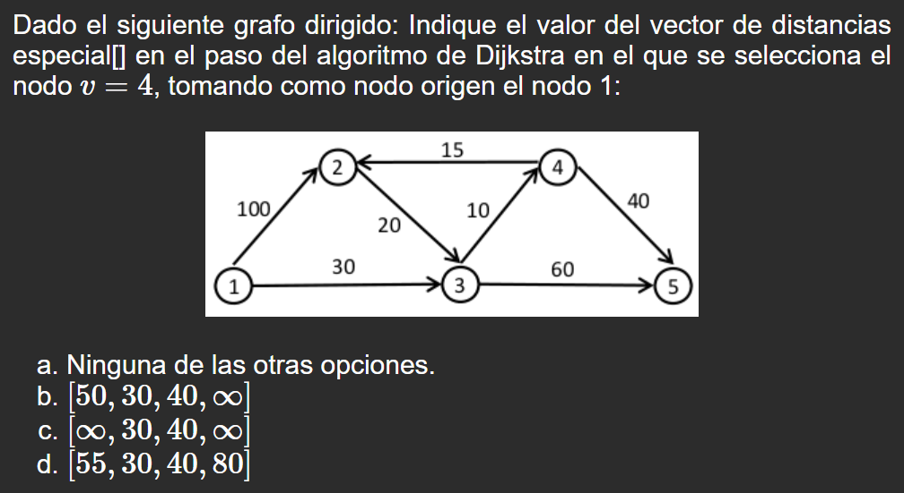
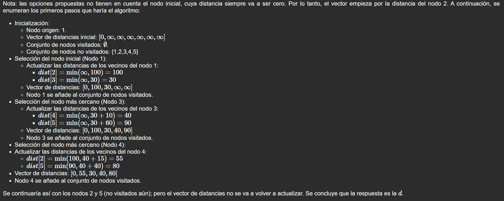
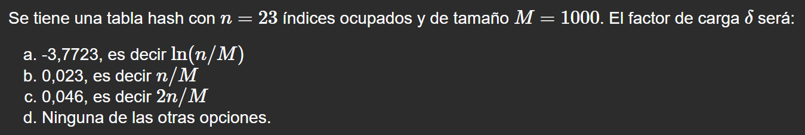
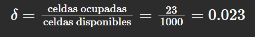
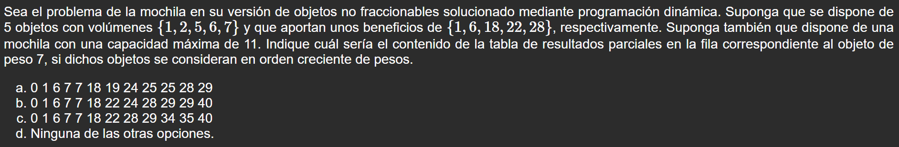
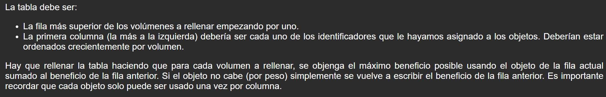

Mazo de la asignatura _Programación y estructuras de Datos avanzadas (PREDA)_ de la Universidad Nacional a Distancia Española UNED. Contiene 106 preguntas cuyo enunciado se ha cogido de una [herramienta de la asignatura](https://ineda.lsi.uned.es/recursos/self-assessment/PREDA/). Incluye preguntas sobre:

- Grafos, con sus respectivas imágenes.
- Pseudocódigo.
- Todos los esquemas vistos en la asignatura.
- Conceptos teóricos:
  - Costes
  - Métodos de hashing
  - Resolución de un problema con el esquema apropiado.

#### Características

Todas las preguntas son de tipo test. Cada respuesta tiene dos secciones, divididas por una línea horizontal:

1. La letra o letras correspondientes a las respuestas de la pregunta. 
2. Razonamiento de la o las respuestas. 

Ciertas preguntas carecen de la segunda sección, teniendo como solo como texto "Nada que comentar", porque la respuesta se ha considerado obvia. 

<table>
  <tr><th scope="col" colspan="2">Ejemplos</th></tr>
  <tr><th scope="col">Front</th><th scope="col">Back</th></tr>
  <tr>
    <td></td>
    <td></td>
  </tr>
    <tr>
    <td></td>
    <td></td>
  </tr>
    </tr>
    <tr>
    <td></td>
    <td></td>
</table>

#### Usar el mazo

Solo tienes que descargar el **preda-deck.apkg** y ejecutarlo. Cuando Anki muestre la pantalla de opciones de importación, no necesitas hacer nada, solo darle a importar.

#### Desarrollo del proyecto

El proceso que se ha seguido para la realización del mazo está inspirado en [este vídeo de Jake Romm](https://www.youtube.com/watch?v=5vh_bWsztPc&t=145s). A partir de los scripts compartidos en su página web, se hizo el [script](docs/formatting-instructions.md) para que ChatGPT formateara los enunciados de las preguntas aplicando HTML y LaTeX. 
